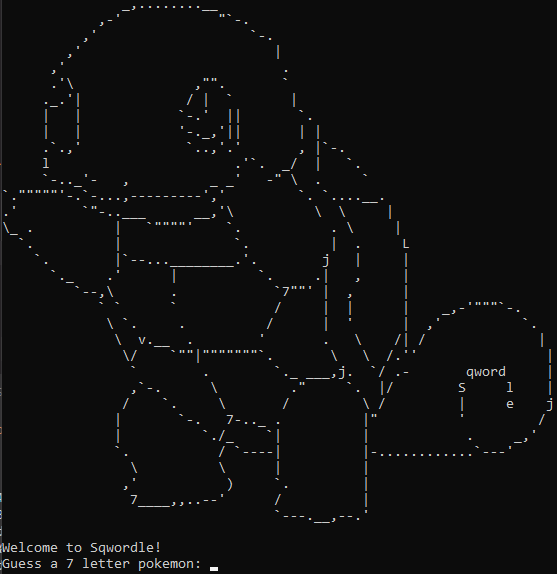
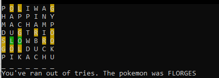

# Sqwordle
Sqwordle is a WSL/Terminal based word guessing game based on Wordle. You get 7 guesses to guess the 7 letter Pokemon name.

### Start screen



### Game


### Install dependencies
For color:
```pip install colorama```
